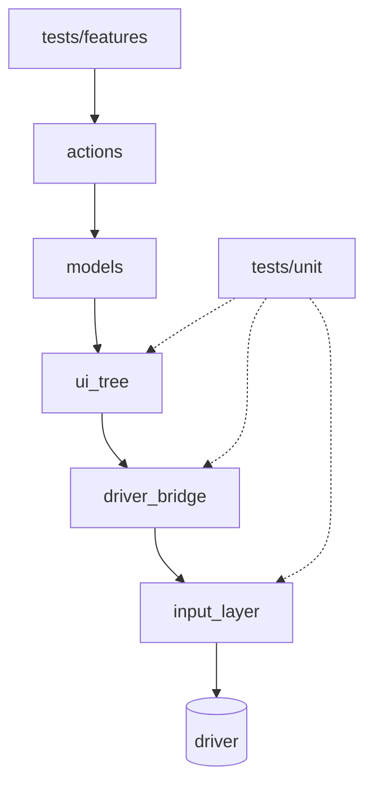

# Архитектура мобильного фреймворка (MVP)

Этот документ описывает упрощённую архитектуру pet-проекта `mobile_automation_framework`,
которая отражает ключевые идеи боевого фреймворка.

## 1. Слои и зависимости

Ключевые слои:

- UI-модели (`models`) — декларативное описание экранов и элементов интерфейса.
- Слой дерева UI-нод (`ui_tree`) — абстракция над внутренним деревом элементов приложения и преобразование логической геометрии в координаты.
- Слой ввода и жестов (`input_layer`) — обёртка над низкоуровневыми действиями драйвера (тапы, свайпы и т.п.), работающая поверх данных `ui_tree`.
- Слой действий (`actions`) — реализация бизнес-сценариев и составных шагов.
- Слой данных и конфигурации (`config`) — хранение платформенных и девайсных профилей, а также env.
- Инфраструктурный слой (`framework/*`) — SessionContext, LaunchConfig, драйвер, сбор компонентов.
- Слой тестов (`src/tests`) — feature-сценарии и unit-тесты.

---

## 2. Тесты и контекст сессии

Назначение слоя тестов:

- формализовать сценарии на разных уровнях абстракции;
- не содержать деталей драйвера и конфигурации запуска.

### SessionContext

В MVP `SessionContext` содержит:

- `driver` — реализация протокола драйвера (в MVP — `FakeDriver`);
- `ui_tree_backend` — источник snapshot-а дерева UI (в MVP — `FakeUiTreeBackend`);
- `input_layer` — слой ввода, исполняющий жесты поверх драйвера;
- `viewport` — размер экрана;
- `config` — `LaunchConfig` (платформа, профили, env).

Тесты верхнего уровня опираются на `actions`, которые принимают `SessionContext`,
и через него получают доступ ко всем необходимым слоям.

---

## 3. Слой ввода и жестов

Слой ввода и жестов представляет собой тонкую абстракцию над низкоуровневым драйвером.
Он принимает на вход логические элементы и их геометрию из `ui_tree`,
а на выходе выполняет реальные действия на устройстве (в MVP — записывает вызовы в `FakeDriver`).

Задачи слоя:

- преобразовать геометрию и bounds нод в координаты, понятные драйверу;
- предоставить стабильный набор операций (tap, swipe и др.);
- скрыть особенности конкретной платформы от `models` и `actions`.

Bridge/`driver_bridge` отвечает исключительно за пересчёт логических координат в координаты экрана,
а `input_layer` — за непосредственное исполнение жестов поверх драйвера.

---

## 4. Конфигурация и запуск

Запуск тестов описывается `LaunchConfig`, который собирается из:

- JSON-конфигов в `config/platforms` и `config/devices`;
- переменных окружения (через `config/env.py`);
- CLI-опций pytest (`--platform`, `--device-profile`, `--log-level`).

За сборку компонентов отвечает блок `framework.launch`:

- `config.py` — формирование `LaunchConfig`;
- `builder.py` — создание драйвера, backend-а ui_tree, viewport и input layer;
- `director.py` — orchestration и возврат готового `SessionContext`.

Фикстуры в `conftest.py` используют эти компоненты, чтобы предоставить тестам готовый `SessionContext`.

---

## 5. Unit-слой

Отдельный слой unit-тестов (`src/tests/unit`) покрывает:

- `ui_tree` — корректность структуры дерева и поиска;
- `driver_bridge` — пересчёт bounds в координаты;
- в будущем — инфраструктурные компоненты (`framework/*`).

Unit-тесты не требуют реального драйвера или приложения,
что позволяет быстро отсекать регрессии инфраструктуры до e2e-прогонов.
