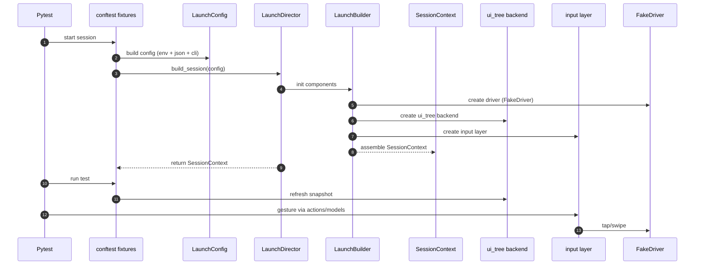

# Потоки запуска (MVP)

Этот документ показывает, как в pet-проекте выглядит запуск тестов
и сбор `SessionContext` без реального Appium.

---

## 1. Диаграмма запуска



---

## 2. Фикстуры pytest

В `conftest.py` определены:

- `pytest_addoption` — CLI-опции:
  - `--platform` (ios|android),
  - `--device-profile` (local|remote),
  - `--log-level`.
- `launch_config` (session scope) — собирает `LaunchConfig` из:
  - JSON-файлов `config/platforms/*.json` и `config/devices/*.json`,
  - переменных окружения (`config/env.py`),
  - CLI-опций.
- `session_context` (session scope) — через `build_session` создаёт `SessionContext`.
- `app_session` (function scope) — обновляет ui_tree snapshot перед каждым тестом.

Такой набор фикстур делает MVP пригодным для запуска как локально, так и в CI,
согласованно с описанной архитектурой.

---

## 3. Запуск тестов

Примеры:

- unit-тесты:

  ```bash
  pytest src/tests/unit
  ```

- feature/smoke-тесты:

  ```bash
  pytest src/tests/features -m "smoke"
  ```

В MVP один feature-тест проходит полный путь: `tests -> actions -> models -> ui_tree -> input layer -> FakeDriver`,
что позволяет убедиться, что архитектурные слои правильно сшиты между собой.
